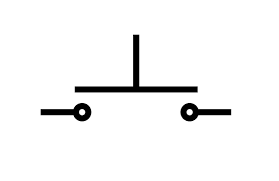
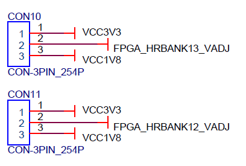

## Introduction

The MS7035 board consists of one SOM(system on module) board and a CAD (carry-board) board, which can cover a wide range of industrial applications or empower the geeks to explore novel designs.

In addition to the zynq-7035, the whole board includes DDR3, EMMC, and QSPI-Flash on the SOM, and a rich set of peripherals , such as,SD card, HDMI, MIPI interface, USB 2.0, Gigabit Ethernet and user IOs，on the CAD.

**Feature**

1. ZYNQ Z-7035
   - 667MHz dual-core Cortex-A9 processor
   - 28nm Kintex-7 FPGA pogrammable logic
2. Memory
     - 1GB DDR3 with 32-bit bus on PS 
     - 2x 256bit QSPI flash
     - 16GB EMMC
3. High Speed Interface
     - PCIe 2.0 x4
     - 4x SFP 
     - Gigabit Ethernet PHY
     - 4 USB 2.0 ports
4. Video peripherals 
     - HDMI out
     - MIPI CSI & DSI Interface
5. Switches, Push-buttons, and LEDs
   - 3 push-buttons
   - 4 slide switches
   - 4 LEDs

6. User Connector
   - 1xPMOD
   - 64 user IO connector
## Specifiction
### Mechanical drawing

The SOM-MS7035 is 80mm x 60mm with four mounting holes (M2.5 metric screws) spaced as shown in the drawings below. The 4 mounting holes are connected to GND.

## Hardware Components
### SOM-board
### Overview 
|            | parts             | Parameter |
| ---------- | ----------------- | --------- |
| FPGA       | XC7Z035-FFG676-2  |           |
| DDR3       | MT41K256M16TW-107 | 1GB       |
| emmc       | THGBMHG7C1LBAIL   | 16GB      |
| QSPI-Flash | W25Q256FVEI       | 2x256bit  |
| connector  | AXK5A2147YG       | 4x        |

#### FPGA

The Zynq7035 family is based on the Xilinx SoC architecture, a heterogeneous system containing an ARM A9 processor and the Kinex-7 equivalent FPGA logics. High speed buses bridge the communication between these two parts, such as 4 general-purpose AXI ports and 4 high-speed AXI ports，shown in figure-1.

Figure-1 Zynq SOC block diagram

[Zynq-7000 SoC Product Guide](https://docs.xilinx.com/v/u/en-US/zynq-7000-product-selection-guide)

[DS191-Z-7035-DC and AC Switching Characteristics](https://www.xilinx.com/content/dam/xilinx/support/documents/data_sheets/ds191-XC7Z030-XC7Z045-data-sheet.pdf)

[UG685-Zynq-7000-SoC Packaging and Pinout](https://docs.xilinx.com/v/u/en-US/ug865-Zynq-7000-Pkg-Pinout)

Figure-2 illustrates the banks inside the chip for the XC7Z035 series , but For the **XCZXC7Z035-FFG676-2**, only the followings are bonded.

- HR  bank bonded: bank12, bank13,

- HP bank bonded: bank33, bank 34, bank 35

- GTX bonded: Quads 111, Quads 112 

 Figure-2: HR and HP banks in ZC7035

Zynq IO banks are designated as either High Performance (HP) or High Density (HD). HP, as its name infers, is where your highest speed IO will be connected, with the VCCO raning from 1.2V to 1.8V and being limited to 1.8V . HD is for general purpose use, providing voltage support from 1.2V to 3.3V and can support a maximum VCCO of 3.3V.

#### DDR3

SOM board contains two DDR3 chips from Micron, 1GB capacity together, running at 1066MT/s. 

| Vender
property
 | Serial Number  
property
 | Package 
property
 |
| :-------------------------------------------: | :----------------------------------------------------: | :---------------------------------------------: |
|                    Micron                     |                   MT41K256M16TW-107                    |                     FBGA-96                     |

| data bus | row address | bank address | column address | page size |
| :------: | :---------: | :----------: | :------------: | :-------: |
|  32 bit  |   15 bit    |    3 bit     |     10 bit     |    2KB    |

#### eMMC

SOM board carries a 16GB eMMC for data storage, which conforms to the JEDEC Version 5.1.

*Cautious: Zynq 7000 FPGAs does not support booting from eMMC.*

| Vender 
property
 | Serial Number 
property
 | Package  
property
 |
| :--------------------------------------------: | :---------------------------------------------------: | :----------------------------------------------: |
|                    TOSHIBA                     |                    THGBMHG7C1LBAIL                    |                    JEDEC 5.1                     |

| emmc signals  
property
 | FPGA signals 
property
 |
| :---------------------------------------------------: | :--------------------------------------------------: |
|                       MMC_DAT0                        |                        MIO46                         |
|                        MMC_CMD                        |                        MIO47                         |
|                       MMC_CCLK                        |                        MIO48                         |
|                       MMC_DATA1                       |                        MIO49                         |
|                       MMC_DATA2                       |                        MIO50                         |
|                       MMC_DATA3                       |                        MIO51                         |

The Vivado design is shown as the following, where the emmc locates at **SD1**

Vivado eMMC configuration

#### QSPI

Two QSPI Flashes are combined in parallel to be 512Mbit Flash with 8-bit bus, which doubles the write-read speed. It provides the non-volatile storage.

W25Q256FV is a 32MiB serial flash memory and contains 131,072  256-Byte pages, arranged to 512 64KiB sectors. Each sector contains 256 256-byte pages. Sectors 0…15 are reserved for device firmware and settings and are not accessible to user software. 

*Cautious: In order to run high speed clock over 40MHz for the QSPI flash, the MIO8 should be left open.*

| Vender  
property
 | Serial Number 
property
 | Package   
property
 |
| :---------------------------------------------: | :---------------------------------------------------: | :-----------------------------------------------: |
|                     Winbond                     |                     W25Q256FVEIG                      |                   WSON-8 8x6mm                    |

| QSPI signals 
property
 | FPGA signals 
property
 |
| :--------------------------------------------------: | :--------------------------------------------------: |
|                       QSPI1_CS                       |                       PS_MIO0                        |
|                       QSPI0_CS                       |                       PS_MIO1                        |
|                       QSPI0_D0                       |                       PS_MIO2                        |
|                       QSPI0_D1                       |                       PS_MIO3                        |
|                       QSPI0_D2                       |                       PS_MIO4                        |
|                       QSPI0_D3                       |                       PS_MIO5                        |
|                      QSPI0_CLK                       |                       PS_MIO6                        |
|                      QSPI1_CLK                       |                       PS_MIO9                        |
|                       QSPI1_D0                       |                       PS_MIO10                       |
|                       QSPI1_D1                       |                       PS_MIO11                       |
|                       QSPI1_D2                       |                       PS_MIO12                       |
|                       QSPI1_D3                       |                       PS_MIO13                       |

The Vivado design is shown as the following, which the MIO8 should be connected as the feedback clock to run over 40MHz. 

Vivado QSPI-Flash configuration

### Carry-board
|               | parts 
property
 | Parameter 
property
 |
| :-----------: | :-------------------------------------------: | :-----------------------------------------------: |
|     PCIe      |                                               |                    PCIe 2.0x4                     |
|      SFP      |                                               |                        4x                         |
|    USB 3.0    |                    FT601Q                     |                                                   |
|   HDMI Out    |                    ADV7511                    |                                                   |
|    USB 2.0    |                                               |                        4x                         |
|   Ethernet    |                  KSZ9031RNX                   |                        1x                         |
|     PMOD      |                                               |                                                   |
|    User IO    |                                               |                       64pin                       |
|  Push Botton  |                                               |                        2x                         |
| Switch Botton |                                               |                        4x                         |
|      LED      |                                               |                        4x                         |
|  BOOT option  |                                               |                                                   |

#### USB3.0
user guide
vivado design
#### Transceivers

4 transceivers are used for transmission.

#### PCIe
#### JTAG & Configuration

2.54mm JTAG connector is provided, and the JTAG connections are wired to the JTAG Header directly. Each pin is protected by the Rectifier Diodes.

For Zynq Series FPGA, it supports 4 master boot modes and 2 JTAG slave boot modes.
Master boot mode means that the boot image can be loaded from external memory devices, such as Quad-SPI flash, SD memory card, NAND Flash, NOR Flash. 

JTAG slave boot modes include Cascade mode and Independent mode. Cascade mode is the most common and default mode. 

Ref [UG585-Technical Reference Manual](https://docs.xilinx.com/v/u/en-US/ug585-Zynq-7000-TRM)

#### HDMI

ADV7511 is a high-performance HDMI transmitter from ADI . It incorpoates HDMI 1.4 features,  supporting the HDMI 1.4-specific features, HEAC (ARC), and 3D video.

In the hardware design, 24 data lines are wired to support 1080P 60Hz, YcbCr 4:4:4 encoding, shown as following.

|  No.  | HDMI signals | FPGA Pin |      FPGA Signals       | IO Standard |
| :---: | :----------: | :------: | :---------------------: | :---------: |
|   1   |   hdmi_clk   |    C4    |      IO_L19P_T3_34      |  LVCMOS18   |
|   2   |  hdmi_d[0]   |    B2    |      IO_L24P_T3_34      |  LVCMOS18   |
|   3   |  hdmi_d[1]   |    A3    |      IO_L22N_T3_34      |  LVCMOS18   |
|   4   |  hdmi_d[2]   |    A4    |      IO_L22P_T3_34      |  LVCMOS18   |
|   5   |  hdmi_d[3]   |    C2    |      IO_L23P_T3_34      |  LVCMOS18   |
|   6   |  hdmi_d[4]   |    B1    |      IO_L23N_T3_34      |  LVCMOS18   |
|   7   |  hdmi_d[5]   |    G6    |      IO_L2P_T0_34       |  LVCMOS18   |
|   8   |  hdmi_d[6]   |    G5    |      IO_L2N_T0_34       |  LVCMOS18   |
|   9   |  hdmi_d[7]   |    F5    |      IO_L7P_T1_34       |  LVCMOS18   |
|  10   |  hdmi_d[8]   |    E5    |      IO_L7N_T1_34       |  LVCMOS18   |
|  11   |  hdmi_d[9]   |    C3    |   IO_L19N_T3_VREF_34    |  LVCMOS18   |
|  12   |  hdmi_d[10]  |    H6    |      IO_L4N_T0_34       |  LVCMOS18   |
|  13   |  hdmi_d[11]  |    H7    |      IO_L4P_T0_34       |  LVCMOS18   |
|  14   |  hdmi_d[12]  |    B4    |      IO_L20N_T3_34      |  LVCMOS18   |
|  15   |  hdmi_d[13]  |    B5    |      IO_L20P_T3_34      |  LVCMOS18   |
|  16   |  hdmi_d[14]  |    D6    |   IO_L14P_T2_SRCC_34    |  LVCMOS18   |
|  17   |  hdmi_d[15]  |    C6    |   IO_L14N_T2_SRCC_34    |  LVCMOS18   |
|  18   |  hdmi_d[16]  |    J8    |      IO_L6P_T0_34       |  LVCMOS18   |
|  19   |  hdmi_d[17]  |    H8    |    IO_L6N_T0_VREF_34    |  LVCMOS18   |
|  20   |  hdmi_d[18]  |    H9    | IO_L3P_T0_DQS_PUDC_B_34 |  LVCMOS18   |
|  21   |  hdmi_d[19]  |    G9    |    IO_L3N_T0_DQS_34     |  LVCMOS18   |
|  22   |  hdmi_d[20]  |    J9    |      IO_L5N_T0_34       |  LVCMOS18   |
|  23   |  hdmi_d[21]  |   J10    |      IO_L5P_T0_34       |  LVCMOS18   |
|  24   |  hdmi_d[22]  |   J11    |      IO_L1P_T0_34       |  LVCMOS18   |
|  25   |  hdmi_d[23]  |   H11    |      IO_L1N_T0_34       |  LVCMOS18   |
|  26   |   hdmi_de    |    A2    |      IO_L24N_T3_34      |  LVCMOS18   |
|  27   |   hdmi_hs    |    A5    |    IO_L21N_T3_DQS_34    |  LVCMOS18   |
|  28   |   hdmi_vs    |    B6    |    IO_L21P_T3_DQS_34    |  LVCMOS18   |

#### SD
#### MIPI
For MIPI(Mobile Industry Processor Interface), the interface standard use the PHY specification known as D-PHY. However, in the zynq series FPGA, there are no dedicated D-PHY IO standards. A resistor bridge can be applied to be compitable to D-PHY standard. More details can be found in [XAPP894-D-PHY Solutions](https://docs.xilinx.com/v/u/3CJjPuMjhJXFySrDuQE6eQ)

|  No.  |        Signals        | FPGA Pin |    FPGA Signals    | IO Standard |
| :---: | :-------------------: | :------: | :----------------: | :---------: |
|   1   |   mipi_phy_clk_lp_p   |    J1    |    IO_L7P_T1_33    |   HSUL_12   |
|   2   |   mipi_phy_clk_lp_n   |    H1    |    IO_L7N_T1_33    |   HSUL_12   |
|   3   | mipi_phy_data_lp_p[0] |    H2    |   IO_L10P_T1_33    |   HSUL_12   |
|   4   | mipi_phy_data_lp_n[0] |    G1    |   IO_L10N_T1_33    |   HSUL_12   |
|   5   | mipi_phy_data_lp_p[1] |    G2    |  IO_L3P_T0_DQS_33  |   HSUL_12   |
|   6   | mipi_phy_data_lp_n[1] |    F2    |  IO_L3N_T0_DQS_33  |   HSUL_12   |
|   7   |   mipi_phy_clk_hs_p   |    G7    | IO_L12P_T1_MRCC_34 |    LVDS     |
|   8   |   mipi_phy_clk_hs_n   |    F7    | IO_L12N_T1_MRCC_34 |    LVDS     |
|   9   | mipi_phy_data_hs_p[0] |    B7    |    IO_18P_T2_34    |    LVDS     |
|  10   | mipi_phy_data_hs_n[0] |    A7    |    IO_18N_T2_34    |    LVDS     |
|  11   | mipi_phy_data_hs_p[1] |    F9    |  IO_L9P_T1_DQS_34  |    LVDS     |
|  12   | mipi_phy_data_hs_n[1] |    E8    |  IO_L9N_T1_DQS_34  |    LVDS     |
#### LED
There are 4 Green/Yellow user LEDs on CAD-MS7035 in addition to power LED (Yellow) and configuration LED (Blue).
User LEDs' anodes are wired to FGPA, serial to 330R resistors.

|  No.  |    LEDs    | FPGA Pin |    FPGA Signals    | IO Standard |
| :---: | :--------: | :------: | :----------------: | :---------: |
|   1   | usr_led[0] |   AD10   |    IO_L7N_T1_12    | VCCO_bank12 |
|   2   | usr_led[1] |   AA10   |  IO_L3N_T0_DQS_12  | VCCO_bank12 |
|   3   | usr_led[2] |   Y17    |   IO_L19P_T3_12    | VCCO_bank12 |
|   4   | usr_led[3] |   AA17   | IO_L19N_T3_VREF_12 | VCCO_bank12 |

#### Push Button
There are there push buttons on the board, of which two are used as the user push buttons and one works as the PS reset. 

The two user push buttons are pulled up to BANK-12 voltage, so the default state is HIGH.

|  NO.  |  Keys  | FPGA Pin |    FPGA Signals    | IO Standard |
| :---: | :----: | :------: | :----------------: | :---------: |
|   1   | key[0] |   AD13   | IO_L12N_T1_MRCC_12 | VCCO_bank12 |
|   2   | key[1] |   AE16   |   IO_L17P_T2_12    | VCCO_bank12 |

#### DIP  Switch 
A 4-position DIP switch is available on the board. And all the four pins are wired to BANK-12

|  NO.  |  DIP   | FPGA Pin |   FPGA Signals    | IO Standard |
| :---: | :----: | :------: | :---------------: | :---------: |
|   1   | DIP[0] |   AC16   | IO_L21N_T3_DQS_12 | VCCO_bank12 |
|   2   | DIP[1] |   AC17   | IO_L21P_T3_DQS_12 | VCCO_bank12 |
|   3   | DIP[2] |   AB16   |   IO_L20N_T3_12   | VCCO_bank12 |
|   4   | DIP[3] |   AB17   |   IO_L20P_T3_12   | VCCO_bank12 |

#### UART
UART is attached to the PS
|  NO.  |   IO    | FPGA Pin |   FPGA Signals   |   BANK   |
| :---: | :-----: | :------: | :--------------: | :------: |
|   1   | UART_TX |  MIO15   | PS_MIO15_UART_TX | BANK 500 |
|   2   | UART_RX |  MIO14   | PS_MIO14_UART_RX | BANK500  |

#### Clock 

A fixed-frequency, 50MHz, low-jitter oscillator is included on-board and outputs LVCMOS to the FPGA on bank 12.
|  NO.  | Frequency | FPGA Pin |    FPGA Signals    | IO Standard |
| :---: | :-------: | :------: | :----------------: | :---------: |
|   1   |   50MHz   |   AC13   | IO_L12P_T1_MRCC_12 | VCCO_bank12 |

Two low-jitter 156.25 MHz oscillators are available to the transceiver portions of the FPGA as a reference. By default, a 156.25 MHz is soldered, and the second oscillator can be soldered, such as 100MHz or 125MHz, to meet the demand of different applications.
|  NO.  | Frequency | FPGA Pin |   FPGA Signals   |  Mounted  |
| :---: | :-------: | :------: | :--------------: | :-------: |
|   1   | 156.25MHz |   AA6    | MGTREFCLK1_111_P |  mounted  |
|   2   | 156.25MHz |   AA5    | MGTREFCLK1_111_N |  mounted  |
|   3   | 156.25MHz |    U6    | MGTREFCLK1_112_P | unmounted |
|   4   | 156.25MHz |    U5    | MGTREFCLK1_112_N | unmounted |

#### VCCO Selection

In order to meet different IO standards' requirement, bank-12 and bank-13 VCCO can be set to `VCC3V3` or `VCC1V8` via the jumper 10 and jumper 11.

#### Expansion Connector

The 56 IOs in the epxansion connector provides flexibility to custom applications. Meanwhile, 5V power can be sourced to the outside load.

|  No.  |  IOs   | FPGA Pin |    FPGA Signals    | IO Standard |
| :---: | :----: | :------: | :----------------: | :---------: |
|   1   | IO[0]  |   AC11   |    IO_L2N_T0_12    | VCCO_bank12 |
|   2   | IO[1]  |   AB12   |    IO_L2P_T0_12    | VCCO_bank12 |
|   3   | IO[2]  |   Y15    |   IO_L23N_T3_12    | VCCO_bank12 |
|   4   | IO[3]  |   Y16    |   IO_L23P_T3_12    | VCCO_bank12 |
|   5   | IO[4]  |   AA14   |   IO_L22N_T3_12    | VCCO_bank12 |
|   6   | IO[5]  |   AA15   |   IO_L22P_T3_12    | VCCO_bank12 |
|   7   | IO[6]  |   AD16   | IO_L15P_T2_DQS_12  | VCCO_bank12 |
|   8   | IO[7]  |   AD15   | IO_L15N_T2_DQS_12  | VCCO_bank12 |
|   9   | IO[8]  |   AC14   | IO_L13P_T2_MRCC_12 | VCCO_bank12 |
|  10   | IO[9]  |   AD14   | IO_L13N_T2_MRCC_12 | VCCO_bank12 |
|  11   | IO[10] |   AB15   | IO_L14P_T2_SRCC_12 | VCCO_bank12 |
|  12   | IO[11] |   AB14   | IO_L14N_T2_SRCC_12 | VCCO_bank12 |
|  13   | IO[12] |   W16    |   IO_L24P_T3_12    | VCCO_bank12 |
|  14   | IO[13] |   W15    |   IO_L24N_T3_12    | VCCO_bank12 |
|  15   | IO[14] |   AA13   |    IO_L6P_T0_12    | VCCO_bank12 |
|  16   | IO[15] |   AA12   | IO_L6N_T0_VREF_12  | VCCO_bank12 |
|  17   | IO[16] |   AC12   | IO_L11P_T1_SRCC_12 | VCCO_bank12 |
|  18   | IO[17] |   AD11   | IO_L11N_T1_SRCC_12 | VCCO_bank12 |
|  19   | IO[18] |   AE17   |   IO_L18P_T2_12    | VCCO_bank12 |
|  20   | IO[19] |   AF17   |   IO_L18N_T2_12    | VCCO_bank12 |
|  21   | IO[20] |   AF15   |   IO_L16P_T2_12    | VCCO_bank12 |
|  22   | IO[21] |   AF14   |   IO_L16N_T2_12    | VCCO_bank12 |
|  23   | IO[22] |   AE13   |   IO_L10P_T1_12    | VCCO_bank12 |
|  24   | IO[23] |   AF13   |   IO_L10N_T1_12    | VCCO_bank12 |
|  25   | IO[24] |   AE12   |    IO_L8P_T1_12    | VCCO_bank12 |
|  26   | IO[25] |   AF12   |    IO_L8N_T1_12    | VCCO_bank12 |
|  27   | IO[26] |   AE11   |  IO_L9P_T1_DQS_12  | VCCO_bank12 |
|  28   | IO[27] |   AF10   |  IO_L9N_T1_DQS_12  | VCCO_bank12 |
|  29   | IO[28] |   AB26   |    IO_L2P_T0_13    | VCCO_bank12 |
|  30   | IO[29] |   AC26   |    IO_L2N_T0_13    | VCCO_bank12 |
|  31   | IO[30] |   AD26   |    IO_L4N_T0_13    | VCCO_bank12 |
|  32   | IO[31] |   AD25   |    IO_L4P_T0_13    | VCCO_bank12 |
|  33   | IO[32] |   AA23   |   IO_L10N_T1_13    | VCCO_bank12 |
|  34   | IO[33] |   AA22   |   IO_L10P_T1_13    | VCCO_bank12 |
|  35   | IO[34] |   AC22   | IO_L14N_T2_SRCC_13 | VCCO_bank12 |
|  36   | IO[35] |   AC21   | IO_L14P_T2_SRCC_13 | VCCO_bank12 |
|  37   | IO[36] |   AE21   |   IO_L16N_T2_13    | VCCO_bank12 |
|  38   | IO[37] |   AE20   |   IO_L16P_T2_13    | VCCO_bank12 |
|  39   | IO[38] |   AD20   | IO_L13P_T2_MRCC_13 | VCCO_bank12 |
|  40   | IO[39] |   AD21   | IO_L13N_T2_MRCC_13 | VCCO_bank12 |
|  41   | IO[40] |   AD19   |   IO_L17N_T2_13    | VCCO_bank12 |
|  42   | IO[41] |   AD18   |   IO_L17P_T2_13    | VCCO_bank12 |
|  43   | IO[42] |   AC19   | IO_L21N_T3_DQS_13  | VCCO_bank12 |
|  44   | IO[43] |   AC18   | IO_L21P_T3_DQS_13  | VCCO_bank12 |
|  45   | IO[44] |   AB21   |  IO_L9P_T1_DQS_13  | VCCO_bank12 |
|  46   | IO[45] |   AB22   |  IO_L9N_T1_DQS_13  | VCCO_bank12 |
|  47   | IO[46] |   Y18    |   IO_L24P_T3_13    | VCCO_bank12 |
|  48   | IO[47] |   AA18   |   IO_L24N_T3_13    | VCCO_bank12 |
|  49   | IO[48] |   AE18   |   IO_L18P_T2_13    | VCCO_bank12 |
|  50   | IO[49] |   AF18   |   IO_L18N_T2_13    | VCCO_bank12 |
|  51   | IO[50] |   AB20   |   IO_L20N_T3_13    | VCCO_bank12 |
|  52   | IO[51] |   AA20   |   IO_L20P_T3_13    | VCCO_bank12 |
|  53   | IO[52] |   AB19   |   IO_L22N_T3_13    | VCCO_bank12 |
|  54   | IO[53] |   AA19   |   IO_L22P_T3_13    | VCCO_bank12 |
|  55   | IO[54] |   W18    |   IO_L23P_T3_13    | VCCO_bank12 |
|  56   | IO[55] |   W19    |   IO_L23N_T3_13    | VCCO_bank12 |

## Developer Reference
### pin map
### constrain files