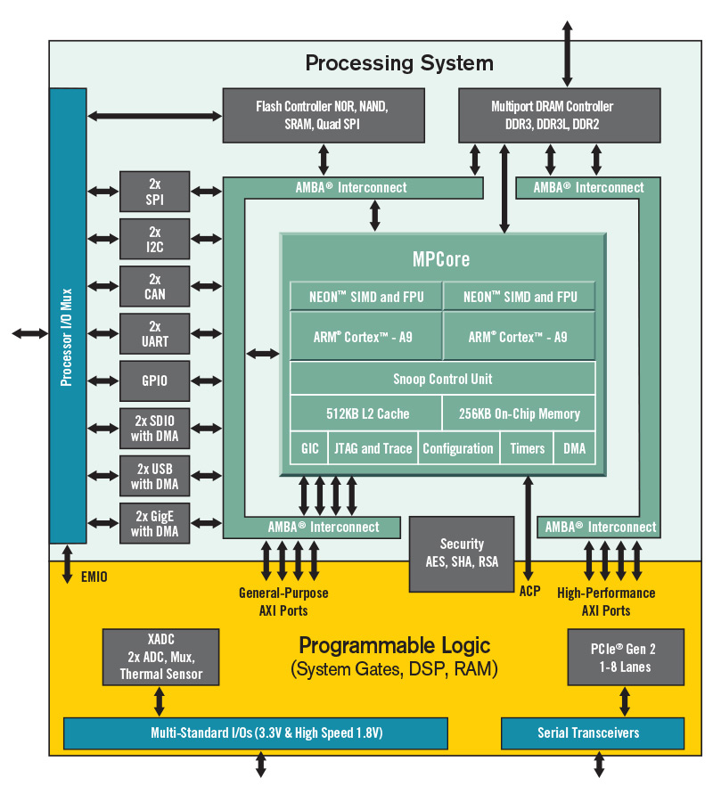
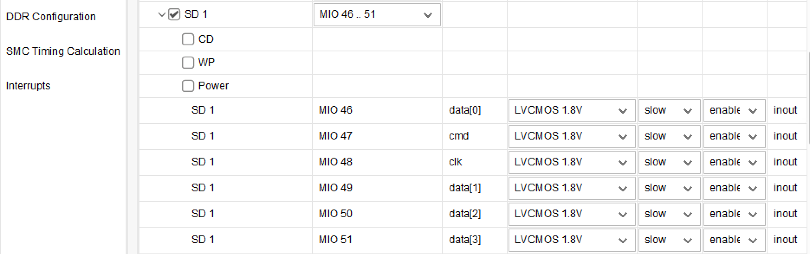
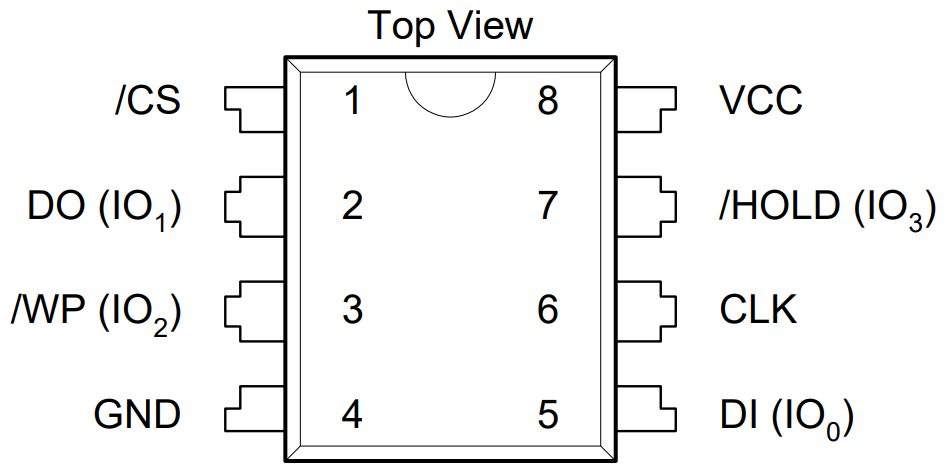
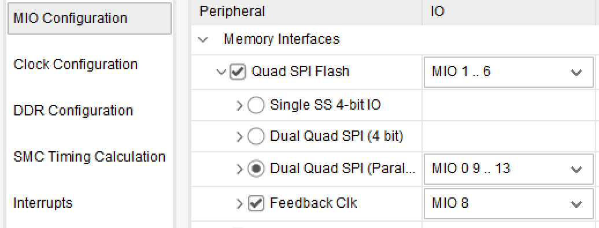
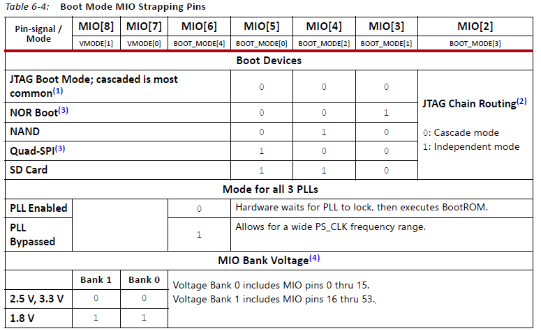

## Introduction

The MS7035 board consists of one SOM(system on module) board and a CAD (carry-board) board, which can cover a wide range of industrial applications or empower the geeks to explore novel designs.

In addition to the zynq-7035, the whole board includes DDR3, EMMC, and QSPI-Flash on the SOM, and a rich set of peripherals , such as,SD card, HDMI, MIPI interface, USB 2.0, Gigabit Ethernet and user IOs，on the CAD.

**Feature**

1. ZYNQ Z-7035
   - 667MHz dual-core Cortex-A9 processor
   - 28nm Kintex-7 FPGA pogrammable logic
2. Memory
     - 1GB DDR3 with 32-bit bus on PS 
     - 2x 256bit QSPI flash
     - 16GB EMMC
3. High Speed Interface
     - PCIe 2.0 x4
     - 4x SFP 
     - Gigabit Ethernet PHY
     - 4 USB 2.0 ports
4. Video peripherals 
     - HDMI out
     - MIPI CSI & DSI Interface
5. Switches, Push-buttons, and LEDs
   - 3 push-buttons
   - 4 slide switches
   - 4 LEDs

6. User Connector
   - 1xPMOD
   - 64 user IO connector

## Hardware Components
### SOM-board
### Overview 
|  | parts | Parameter |
| ------ | ------ | ------ |
| FPGA |  XC7Z035-FFG676-2|  |
| DDR3 |  MT41K256M16TW-107 | 1GB |
| emmc | THGBMHG7C1LBAIL | 16GB |
| QSPI-Flash | W25Q256FVEI | 2x256bit |
| connector |  AXK5A2147YG  |  4x|

#### FPGA

The Zynq7035 family is based on the Xilinx SoC architecture, a heterogeneous system containing an ARM A9 processor and the Kinex-7 equivalent FPGA logics. High speed buses bridge the communication between these two parts, such as 4 general-purpose AXI ports and 4 high-speed AXI ports，shown in figure-1.

Figure-1 Zynq SOC block diagram

[Zynq-7000 SoC Product Guide](https://docs.xilinx.com/v/u/en-US/zynq-7000-product-selection-guide)

[DS191-Z-7035-DC and AC Switching Characteristics](https://www.xilinx.com/content/dam/xilinx/support/documents/data_sheets/ds191-XC7Z030-XC7Z045-data-sheet.pdf)

[UG685-Zynq-7000-SoC Packaging and Pinout](https://docs.xilinx.com/v/u/en-US/ug865-Zynq-7000-Pkg-Pinout)

Figure-2 illustrates the banks inside the chip for the XC7Z035 series , but For the **XCZXC7Z035-FFG676-2**, only the followings are bonded.

- HR  bank bonded: bank12, bank13,

- HP bank bonded: bank33, bank 34, bank 35

- GTX bonded: Quads 111, Quads 112 

 Figure-2: HR and HP banks in ZC7035

Zynq IO banks are designated as either High Performance (HP) or High Density (HD). HP, as its name infers, is where your highest speed IO will be connected, with the VCCO raning from 1.2V to 1.8V and being limited to 1.8V . HD is for general purpose use, providing voltage support from 1.2V to 3.3V and can support a maximum VCCO of 3.3V.

#### DDR3

SOM board contains two DDR3 chips from Micron, 1GB capacity together, running at 1066MT/s. 

| Vender
property
 |   Serial Number  
property
 | Package 
property
|
| :----: | :---------------: | :-----: |
| Micron | MT41K256M16TW-107 | FBGA-96 |

| data bus | row address | bank address | column address | page size |
| :------: | :---------: | :----------: | :------------: | :-------: |
|  32 bit  |   15 bit    |    3 bit     |     10 bit     |    2KB    |

#### eMMC

SOM board carries a 16GB eMMC for data storage, which conforms to the JEDEC Version 5.1.

*Cautious: Zynq 7000 FPGAs does not support booting from eMMC.*

| Vender 
property
 |  Serial Number 
property
|  Package  
property
|
| :-----: | :-------------: | :-------: |
| TOSHIBA | THGBMHG7C1LBAIL | JEDEC 5.1 |

| emmc signals  
property
| FPGA signals 
property
|
| :----------: | :----------: |
|   MMC_DAT0   | MIO46 |
|   MMC_CMD    | MIO47 |
|   MMC_CCLK   | MIO48 |
|  MMC_DATA1   | MIO49 |
|  MMC_DATA2   | MIO50 |
|  MMC_DATA3   | MIO51 |

The Vivado design is shown as the following, where the emmc locates at **SD1**

Vivado eMMC configuration

#### QSPI

Two QSPI Flashes are combined in parallel to be 512Mbit Flash with 8-bit bus, which doubles the write-read speed. It provides the non-volatile storage.

W25Q256FV is a 32MiB serial flash memory and contains 131,072  256-Byte pages, arranged to 512 64KiB sectors. Each sector contains 256 256-byte pages. Sectors 0…15 are reserved for device firmware and settings and are not accessible to user software. 

*Cautious: In order to run high speed clock over 40MHz for the QSPI flash, the MIO8 should be left open.*

| Vender  
property
| Serial Number 
property
|   Package   
property
 |
| :-----: | :-----------: | :----------: |
| Winbond | W25Q256FVEIG  | WSON-8 8x6mm |

| QSPI signals 
property
| FPGA signals 
property
|
| :----------: | :----------: |
|   QSPI1_CS   |   PS_MIO0    |
|   QSPI0_CS   |   PS_MIO1    |
|   QSPI0_D0   |   PS_MIO2    |
|   QSPI0_D1   |   PS_MIO3    |
|   QSPI0_D2   |   PS_MIO4    |
|   QSPI0_D3   |   PS_MIO5    |
|  QSPI0_CLK   |   PS_MIO6    |
|  QSPI1_CLK   |   PS_MIO9    |
|   QSPI1_D0   |   PS_MIO10   |
|   QSPI1_D1   |   PS_MIO11   |
|   QSPI1_D2   |   PS_MIO12   |
|   QSPI1_D3   |   PS_MIO13   |

The Vivado design is shown as the following, which the MIO8 should be connected as the feedback clock to run over 40MHz. 

Vivado QSPI-Flash configuration

### Carry-board
|  | parts 
property
| Parameter 
property
|
| :----: | :----: | :----: |
| PCIe |  | PCIe 2.0x4  |
|SFP ||4x|
|USB 3.0| FT601Q||
|HDMI Out|ADV7511||
|USB 2.0||4x|
|Ethernet|KSZ9031RNX|1x|
|PMOD|||
|User IO||64pin|
|Push Botton||2x|
|Switch Botton||4x|
|LED||4x|
|BOOT option|||

#### USB3.0
user guide
vivado design
#### SFP

#### PCIe
#### JTAG & Configuration

For Zynq Series FPGA, it supports 4 master boot modes and 2 JTAG slave boot modes.
Master boot mode means that the boot image can be loaded from external memory devices, such as Quad-SPI flash, SD memory card, NAND Flash, NOR Flash. 

JTAG slave boot modes include Cascade mode and Independent mode. Cascade mode is the most common and default mode. 

Ref [UG585-Technical Reference Manual](https://docs.xilinx.com/v/u/en-US/ug585-Zynq-7000-TRM)

#### HDMI

ADV7511 is a high-performance HDMI transmitter from ADI . It incorpoates HDMI 1.4 features,  supporting the HDMI 1.4-specific features, HEAC (ARC), and 3D video.

In the hardware design, 24 data lines are wired to support 1080P 60Hz, YcbCr 4:4:4 encoding, shown as following.

| No. | HDMI signals |FPGA Pin |FPGA Signals| IO Standard|
| :----: | :----: | :----: |:----: |:----: |
|1 |hdmi_clk|C4| IO_L19P_T3_34|LVCMOS18|
|2 |hdmi_d[0]  |B2   |IO_L24P_T3_34       |LVCMOS18|
|3 |hdmi_d[1]  |A3   |IO_L22N_T3_34       |LVCMOS18|
|4 |hdmi_d[2]  |A4   |IO_L22P_T3_34       |LVCMOS18|
|5 |hdmi_d[3]  |C2   |IO_L23P_T3_34       |LVCMOS18|
|6 |hdmi_d[4]  |B1   |IO_L23N_T3_34       |LVCMOS18|
|7 |hdmi_d[5]  |G6   |IO_L2P_T0_34        |LVCMOS18|
|8 |hdmi_d[6]  |G5   |IO_L2N_T0_34        |LVCMOS18|
|9 |hdmi_d[7]  |F5   |IO_L7P_T1_34        |LVCMOS18|
|10|hdmi_d[8]  |E5   |IO_L7N_T1_34        |LVCMOS18|
|11|hdmi_d[9]  |C3   |IO_L19N_T3_VREF_34  |LVCMOS18|
|12|hdmi_d[10] |H6   |IO_L4N_T0_34        |LVCMOS18|
|13|hdmi_d[11] |H7   |IO_L4P_T0_34        |LVCMOS18|
|14|hdmi_d[12] |B4   |IO_L20N_T3_34       |LVCMOS18|
|15|hdmi_d[13] |B5   |IO_L20P_T3_34       |LVCMOS18|
|16|hdmi_d[14] |D6   |IO_L14P_T2_SRCC_34  |LVCMOS18|
|17|hdmi_d[15] |C6   |IO_L14N_T2_SRCC_34  |LVCMOS18|
|18|hdmi_d[16] |J8   |IO_L6P_T0_34        |LVCMOS18|
|19|hdmi_d[17] |H8   |IO_L6N_T0_VREF_34   |LVCMOS18|
|20|hdmi_d[18] |H9   |IO_L3P_T0_DQS_PUDC_B_34 |LVCMOS18|
|21|hdmi_d[19] |G9   |IO_L3N_T0_DQS_34    |LVCMOS18|
|22|hdmi_d[20] |J9   |IO_L5N_T0_34        |LVCMOS18|
|23|hdmi_d[21] |J10  |IO_L5P_T0_34        |LVCMOS18|
|24|hdmi_d[22] |J11  |IO_L1P_T0_34        |LVCMOS18|
|25|hdmi_d[23] |H11  |IO_L1N_T0_34        |LVCMOS18|
|26|hdmi_de    |A2   |IO_L24N_T3_34       |LVCMOS18|
|27|hdmi_hs    |A5   |IO_L21N_T3_DQS_34   |LVCMOS18|
|28|hdmi_vs    |B6   |IO_L21P_T3_DQS_34   |LVCMOS18|

#### SD
#### MIPI
#### LED
#### Push Button
#### Switch Button
#### UART
#### Clock 
#### User IO

#### expansion connector

## Developer Reference
### pin map
### constrain files